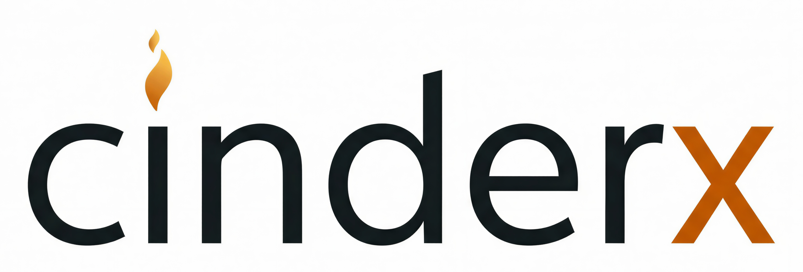

# CinderX

<!-- hy-mt2-i18n:start -->
[English](./README.md) | [中文](./README_zh-CN.md) | [日本語](./README_ja.md) | **Español**
<!-- hy-mt2-i18n:end -->


[](https://pypi.org/pypi/cinderx/)



CinderX es una extensión para Python que mejora el rendimiento del entorno de ejecución de Python.

## Estado

CinderX se encuentra en desarrollo activo. Se utiliza en entornos de producción en Meta para casos de uso como el servicio Django de Instagram. Para usuarios externos, se trata de una versión **experimental**. Las nuevas versiones se publican en PyPI semanalmente.

## Funcionalidades

- **Compilador JIT** - Compilación justa-a-tiempo del bytecode de Python en código
  máquina nativo  
- **Python estático** - Una forma/subconjunto más estricto de Python, destinado a la
  seguridad de tipos y la optimización

La base de código también incluye otras características, como un recolector de basura en paralelo y una implementación más ligera de los marcos del intérprete de Python. Sin embargo, estas funciones aún no son compatibles con el entorno de ejecución CPython estándar.

## Requisitos

- Python 3.14  
- GCC 13+ o Clang 18+

|         |        Linux       |        macOS       |       Windows      |
| ------- | ------------------ | ------------------ | ------------------ |
|  x86-64 | :white_check_mark: |         :x:        | :white_check_mark: |
| aarch64 | :white_check_mark: | :white_check_mark: |         :x:        |

## Instalación

```bash
pip install cinderx
```

## Uso del JIT

La forma recomendada para comenzar a usar el JIT es la siguiente:

```python
import cinderx.jit

cinderx.jit.auto()
```

Esto configurará la extensión CinderX para compilar automáticamente las funciones de Python en código máquina. Supervisará qué funciones se llaman con frecuencia y compilará automáticamente las más utilizadas.

Consulte [la documentación del JIT](https://facebookincubator.github.io/cinderx/jit) para obtener más detalles, o explore el sitio completo de [documentación de CinderX](https://facebookincubator.github.io/cinderx/).

## CinderX vs Cinder

[Cinder](https://github.com/facebookincubator/cinder) era una bifurcación del entorno de ejecución CPython desarrollada en Meta. Incluía optimizaciones para el entorno de ejecución (como JIT) y estaba diseñada específicamente para la base de código Django de Instagram. Para Python 3.10, Meta decidió convertirla en una extensión de Python con el fin de mejorar la compatibilidad con versiones más recientes de este lenguaje. Esta extensión ahora se conoce como CinderX (“la X” hace referencia a “extensión”).

Históricamente, para las versiones de Python 3.10 a 3.12, CinderX dependía de parches aplicados a la versión modificada del entorno de ejecución Python desarrollada por Meta. Python 3.14 es la primera versión del CPython estándar que CinderX soporta.

## Licencia

CinderX está licenciado bajo la licencia MIT; consulte el archivo LICENSE.

## Términos de uso

https://opensource.fb.com/legal/terms

## Política de privacidad

https://opensource.fb.com/legal/privacy-policy

---

Copyright © 2025 Meta Platforms, Inc.
